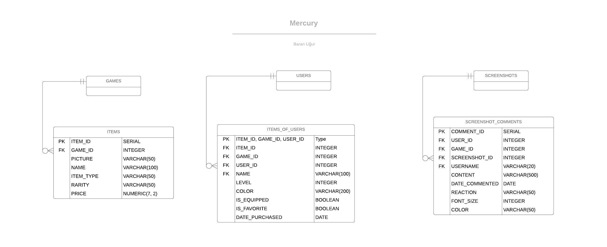

Parts Implemented by Lütfi Baran Uğur
*************************************

Database Design
===============
For this project, I have worked on the tables
ITEMS, ITEMS_OF_USERS & SCREENSHOT_COMMENTS
and their related functions.

* The "ITEMS" table contains the items available for a game on the website.
* The "ITEMS_OF_USERS" table contains the items owned by a user.
* The "SCREENSHOT_COMMENTS" table contains the comments made on a screenshot.

Code
=====

Database Functions
-------------------
.. automodule:: database_baran
    :members: Database

Server Functions
-------------------
.. automodule:: server_baran
    :members: Server
