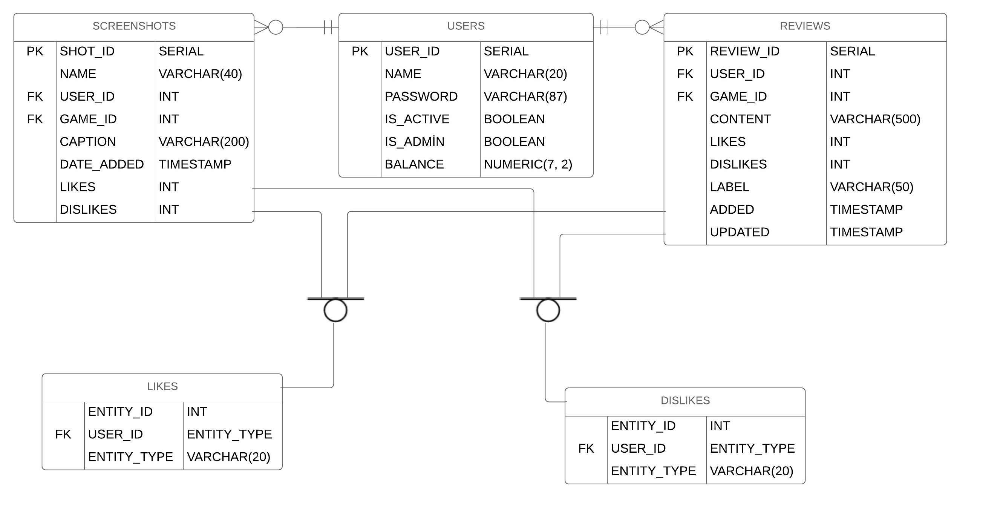

Parts Implemented by Cavit Özbay
********************************

Database Design
===============

An important point that needs an explanation is the relationship of
the tables LIKES and DISLIKES with others. First of all, they are not
actually supertypes of the tables REVIEWS and SCREENSHOTS. However
they are replicate supertype relationship. If the likes and dislikes
datas of REVIEWS and SCREENSHOTS are kept in the same table, they have
to have unique foreign keys. That means, a row of LIKES or DISLIKES
tables has to reference one and only one row in other two tables
(REVIEWS and SCREENSHOTS). Otherwise, we can not differentiate if a
row of the LIKES or DISLIKES references to either the REVIEWS or the
SCREENSHOTS. In order to provide that, a supertype of REVIEWS and
SCREENSHOTS that has only a primary key may be implemented, and that
keys may be used to reference as a foreign key from only one of the
REVIEWS and SCREENSHOTS (that foreign key also is the primary key for
that table). Instead of that, it is used an additional column called
ENTITY_TYPE in the tables LIKES and DISLIKES in order to determine the
table that is referenced from each row.

Code
====

Server Functions
----------------

**server.add_review(game_id)**

   Since each user may have only one review for each game, first two
   line checks if the user have a previous review for the game or not.

   ::

      prev_review = db.get_prev_review(game_id, current_user.id)
      duplicate = len(prev_review) != 0

   If request method is "POST", processes insertion or update. If not,
   renders the template with empty form or form within the previous
   review data according to bool value duplicate.

**server.add_screenshot(game_id)**

   Handles with screenshot addition. If method is “GET”, displays the
   addition page. If method is “POST”, tries to save image into the
   file system by using flask-uploads, tries to insert the related
   data into the database, and displays the result page about those
   two operations’ success.

**server.delete_review()**

   Delete the review

**server.delete_screenshot()**

   Deletes the screenshot. Since the image file is not stored in the
   database, it must be deleted additionally.

**server.delete_user(user_id)**

   Deletes the user with id user_id if current user is able to do it.
   Redirects to the home page.

**server.game_page(game_id)**

   Since the visitors also may access to a game page, reviews and
   screenshots may not be displayed for all cases. They are displayed
   only when the current user is logged in.

   ::

      if current_user.is_authenticated:
          reviews = db.get_reviews_of_game(game_id, current_user.id)
          screenshots = db.get_screenshots_of_game(game_id, current_user.id)

**server.login()**

   If method is “POST” and request values are valid, makes user logged
   in and redirects to the profile. Else renders “login.html”.

**server.process_likes_dislikes()**

   Handles with all like and dislike operations. It is called with an
   AJAX request. Like operation procedure is below (the similar
   procedure is followed for dislikes).

   ::

      if request.form.get("sit4process") == "like":
          if request.form.get("like_sit") == "Like":
              if request.form.get("entity_type") in entities:
                  db.add_like(request.form.get("entity_id"), current_user.id, request.form.get("entity_type"))
          if request.form.get("like_sit") == "You Liked It":
              if request.form.get("entity_type") in entities:
                  db.remove_like(request.form.get("entity_id"), current_user.id, request.form.get("entity_type"))

   "sit4process" determines that if request is made for like or dislike
   operation. "like_sit" determines that if request is made for liking
   or removing a like. "entity_type" determines the type entity that the
   subject of operation. It has to be in the list entities. After the
   operations, a JSON object is returned.

**server.profile(user_id)**

   My parts in this function is only covers getting the reviews and
   screenshots of the profile owner and pass them to the
   “profile.html”. They are displayed in all cases.

**server.screenshot(game_id, shot_id)**

   Screenshot is displayed with full size and its other features
   (likes, dislikes, addition time etc.).

**server.sign_up_result()**

   It is used for handling with sign up requests and and it is
   accessible only with the “POST” method.

Database Functions
------------------

**class database.Database(dsn)**

   Fuctions that I query database are:

   **add_dislike(entity_id, user_id, entity_type)**

      Inserts a row into the table “DISLIKES” with given values.

      :Parameters:
         * **user_id** (*int*) – User id that references the table “USERS”.

         * **entity_type** (*str*) – Entity type may be either “REVIEWS” or “SCREENSHOTS”.

         * **entity_id** (*int*) – Id that references the table given in the entity_type.

   **add_like(entity_id, user_id, entity_type)**

      Inserts a row into the table “LIKES” with given values.

      :Parameters:
         * **user_id** (*int*) – User id that references the table “USERS”.

         * **entity_type** (*str*) – Entity type may be either “REVIEWS” or “SCREENSHOTS”.

         * **entity_id** (*int*) – Id that references the table given in the entity_type.

   **delete_review(review_id)**

      Deletes all rows from the table “REVIEWS” with the review id
      review_id. Also deletes the related rows from the tables “LIKES”
      and “DISLIKES”.

      :Parameters:
         **review_id** (*int*) – review id to delete.

   **delete_screenshot(shot_name)**

      Deletes all rows from the table “SCREENSHOTS” with the shot id
      shot_id.

      :Parameters:
         **review_id** (*int*) – review id to delete.

   **delete_user(user_id)**

      Deletes all from the table “USERS” with the id user_id.

      :Parameters:
         **user_id** (*int*) – user id to delete.

   **get_dislike_of_user(entity_id, user_id, entity_type)**

      Selects all from the table “DISLIKES” with the given values.
      Returns True if there is a row, returns False otherwise.

      :Parameters:
         * **user_id** (*int*) – User id that references the table “USERS”.

         * **entity_type** (*str*) – Entity type may be either “REVIEWS” or “SCREENSHOTS”.

         * **entity_id** (*int*) – Id that references the table given in the entity_type.

   **get_like_of_user(entity_id, user_id, entity_type)**

      Selects all from the table “LIKES” with the given values.
      Returns True if there is a row, returns False otherwise.

      :Parameters:
         * **user_id** (*int*) – User id that references the table “USERS”.

         * **entity_type** (*str*) – Entity type may be either “REVIEWS” or “SCREENSHOTS”.

         * **entity_id** (*int*) – Id that references the table given in the entity_type.

   **get_prev_review(game_id, user_id)**

      Selects all from the table “REVIEWS” with the game id game_id
      and user id user_id. Returns a list of Review objects.
      Intuitively list may have 1 object at most.

      :Parameters:
         * **game_id** (*int*) – game id to select.

         * **user_id** (*int*) – user id to select.

   **get_review(review_id)**

      Selects all from the table “REVIEWS” with the review id
      review_id. Returns a Review object for given review id if there
      is a row, returns None otherwise.

      :Parameters:
         **review_id** (*int*) – review id to select.

   **get_reviews_of_game(game_id, cur_user_id)**

      Selects all from the table “REVIEWS” and also the related user
      name with the game id game_id. Checks each review if the user
      with the user id cur_user_id liked or disliked it. Returns a
      list of Review objects in descending order according to the
      addition time.

      :Parameters:
         * **game_id** (*int*) – game id to select.

         * **cur_user_id** (*int*) – user id to check like/dislike situations.

   **get_reviews_of_user(user_id, cur_user_id)**

      Selects all from the table “REVIEWS” and also the related game
      titles with the user id user_id. Checks each review if the user
      with the user id cur_user_id liked or disliked it. Returns a
      list of Review objects in descending order according to the
      addition time.

      :Parameters:
         * **user_id** (*int*) – user id to select.

         * **cur_user_id** (*int*) – user id to check like/dislike situations.

   **get_screenshot(shot_id)**

      Selects all from the table “SCREENSHOTS” with the shot id
      shot_id. Returns a Screenshot object for given shot id.

      :Parameters:
         **shot_id** (*int*) – shot id to select.

   **get_screenshots_of_game(game_id, cur_user_id)**

      Selects all from the table “SCREENSHOTS” and also the related
      user names with the game id game_id. Checks each screenshot if
      the user with the user id cur_user_id liked or disliked it.
      Returns a list of Screenshot objects in descending order
      according to the addition time.

      :Parameters:
         * **game_id** (*int*) – game id to select.

         * **cur_user_id** (*int*) – user id to check like/dislike situations.

   **get_screenshots_of_user(user_id, cur_user_id)**

      Selects all from the table “SCREENSHOTS” and also the related
      game titles with the user id user_id. Checks each screenshot if
      the user with the user id cur_user_id liked or disliked it.
      Returns a list of Screenshot objects in descending order
      according to the addition time.

      :Parameters:
         * **user_id** (*int*) – user id to select.

         * **cur_user_id** (*int*) – user id to check like/dislike situations.

   **get_user(user_id)**

      Selects all from the table “USERS” with the user id user_id.
      Returns a User object for given userid if there is a row,
      returns None otherwise.

      :Parameters:
         **user_id** (*int*) – user id to select.

   **get_user_id(user_name)**

      Selects user id from the table “USERS” with the name user_name.
      Returns a User object for given user name if there is a row,
      returns None otherwise.

      :Parameters:
         **user_name** (*str*) – user name to select.

   **insert_review(review)**

      Inserts a review into the table “REVIEWS”.

      :Parameters:
         **review** (*Review*) – Review object to insert.

   **insert_screenshot(ss)**

      Inserts a screenshot into the table “SCREENSHOTS”.

      :Parameters:
         **ss** (*Screenshot*) – Screenshot object to insert.

   **insert_user(user_to_insert)**

      Inserts a user into the table “USERS”.

      :Parameters:
         **user_to_insert** (*User*) – User object to insert.

   **query_user_name(user_name)**

      Selects all from the table “USERS” with the name user_name.
      Returns a User object for given user name if there is a row,
      returns None otherwise.

      :Parameters:
         **user_name** (*str*) – user name to select.

   **remove_dislike(entity_id, user_id, entity_type)**

      Deletes a row from the table “DISLIKES” with given values.

      :Parameters:
         * **user_id** (*int*) – User id that references the table “USERS”.

         * **entity_type** (*str*) – Entity type may be either “REVIEWS” or “SCREENSHOTS”.

         * **entity_id** (*int*) – Id that references the table given in the entity_type.

   **remove_like(entity_id, user_id, entity_type)**

      Deletes a row from the table “LIKES” with given values.

      :Parameters:
         * **user_id** (*int*) – User id that references the table “USERS”.

         * **entity_type** (*str*) – Entity type may be either “REVIEWS” or “SCREENSHOTS”.

         * **entity_id** (*int*) – Id that references the table given in the entity_type.

   **update_review(review_id, label, content, edited)**

      Updates reviews with review id review_id.

      :Parameters:
         **review_id** (*int*) – review id to update.

Javascript Functions
--------------------

**timezone_handler.js**

Handles with displaying the time features of reviews and screenshots
according to local time. It listens for the members of “timeobj”
class.

::

   {{review.added.timestamp()*1000}}

The members of the class includes the time value in milliseconds in
utc timezone.

::

   document.addEventListener('DOMContentLoaded', function() {

       document.querySelectorAll('.timeobj').forEach(function(x) {
           var d = new Date();
           d.setTime(parseInt(x.innerHTML) - d.getTimezoneOffset() * 60 * 1000);

           x.innerHTML = d.toLocaleDateString() + " " + d.toLocaleTimeString().substr(0, 5);
       });
   });

timezone_handler takes that value, converts it to the local time, and
change the innerHTML of object with the calculated value.

**likesdislikes_handler.js**

Handles with like and dislike operations by making AJAX requests.

::

   function toggle_like(x) {
           if(x.innerHTML === "Like"){
           x.innerHTML="You Liked It";
           document.querySelectorAll(".dislikes").forEach(function(button) {
               if(button.dataset.ent_type === x.dataset.ent_type && button.value === x.value)
                   button.disabled = true;
           });
       }
       else{
           x.innerHTML="Like";
           document.querySelectorAll(".dislikes").forEach(function(button) {
               if(button.dataset.ent_type === x.dataset.ent_type && button.value === x.value)
                   button.disabled = false;
           });
       }
   }

toggle_like function toggles the innerHTML of the like button between
“Like” and “You Liked It”. Also, disables the related “Dislike”
button. toggle_dislike makes the similar operations for “Dislike”
button.

::

   document.addEventListener('DOMContentLoaded', function() {

       document.querySelectorAll('.likes').forEach(function(button) {
           button.onclick = function() {
               const request = new XMLHttpRequest();
               const like_sit = button.innerHTML;
               request.open('POST', '/process_likes_dislikes/');

For each member of the “likes” class a new request is created on click
situation.

::

               const data = new FormData();
               data.append('entity_id', button.value);
               data.append('sit4process', "like");
               data.append('like_sit', like_sit);
               data.append('entity_type', button.dataset.ent_type);
               document.querySelectorAll(".dislikes").forEach(function(x) {
                   if(button.dataset.ent_type === x.dataset.ent_type && button.value === x.value)
                       x.disabled = true;
               });
               document.querySelectorAll(".likes").forEach(function(x) {
                   if(button.dataset.ent_type === x.dataset.ent_type && button.value === x.value)
                       x.disabled = true;
               });

               request.send(data);
               return false;
           };
       });
   });

New FormData() object keeps the proper data. Before the sending data,
both “Like” and “Dislike” buttons are disabled.Then, the FormData is
sent.

::

   request.onload = () => {

       const data = JSON.parse(request.responseText);
       if (data.success) {
           toggle_like(button);
           document.querySelectorAll(".likes").forEach(function(x) {
               if(button.dataset.ent_type === x.dataset.ent_type && button.value === x.value)
                   x.disabled = false;
           });
       }
   }

On load situation after the sending request, JSON object is parsed and
is looked for if the operation was successful. If it is, buttons are
edited according to new situation.

For dislike operation, the similar process is followed.
