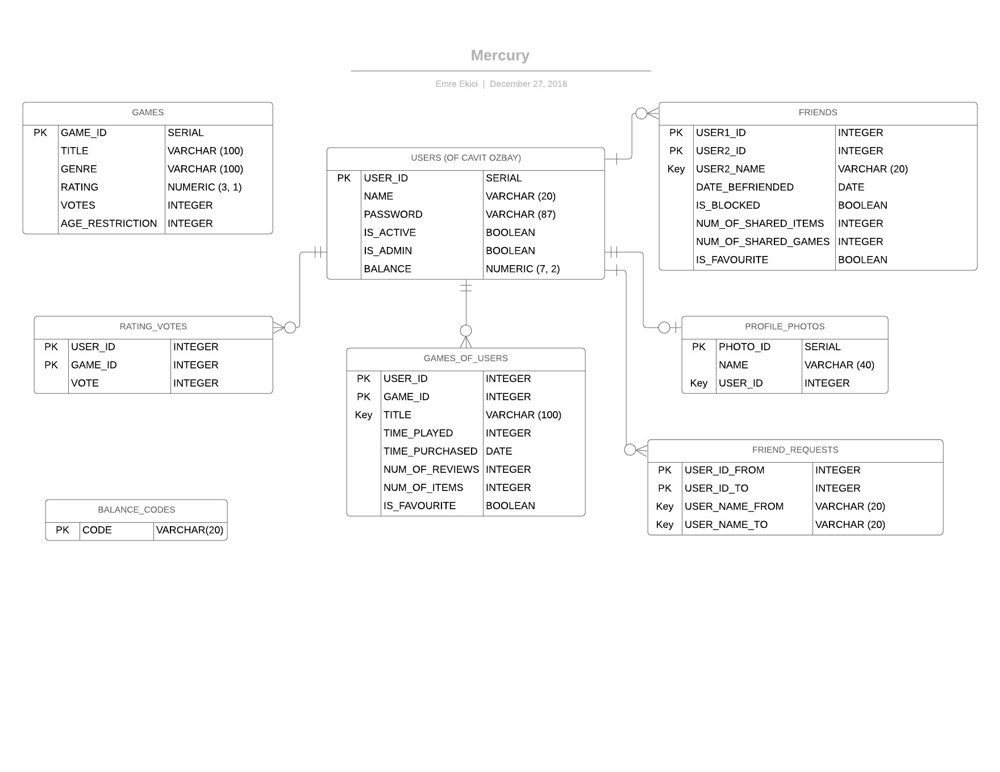

Parts Implemented by Ömer Emre Ekici
====================================
For this project, I have worked on the tables GAMES, GAMES_OF_USERS &
FRIENDS, FRIEND_REQUESTS, PROFILE_PHOTOS, BALANCE_CODES, RATING_VOTES
and their related functions.

Database Design
---------------

* The "GAMES" table contains the games available on the website.
* The "GAMES_OF_USERS" table contains the games owned by a user.
* The "FRIENDS" table contains the data of two users who are friends.
* The "FRIEND_REQUESTS" table contains the requests sent by a user
  to another user.
* The "PROFILE_PHOTOS" table contains the user's profile photo data.
* The "RATING_VOTES" table contains the ratings a user made for each
  game.

Code
----
Database Functions
~~~~~~~~~~~~~~~~~~
.. automodule:: database_emre
    :members: Database

Server Functions
~~~~~~~~~~~~~~~~
.. automodule:: server_emre
    :members: Server

Javascript Functions
~~~~~~~~~~~~~~~~~~~~
