Parts Implemented by Lütfi Baran Uğur
*************************************

ITEMS
=====

Items are displayed under the games that they belong to.
Items can be added, deleted and edited only by admins,
but can be seen by everyone.

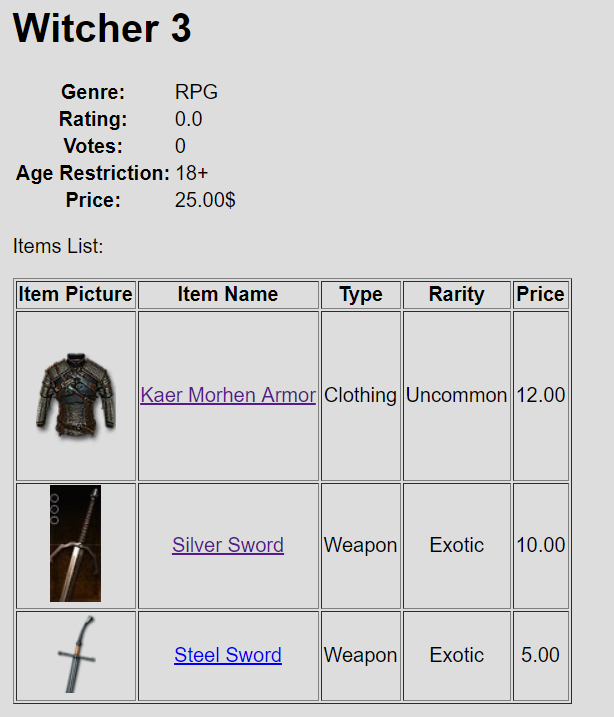

   Items as seen by a regular user

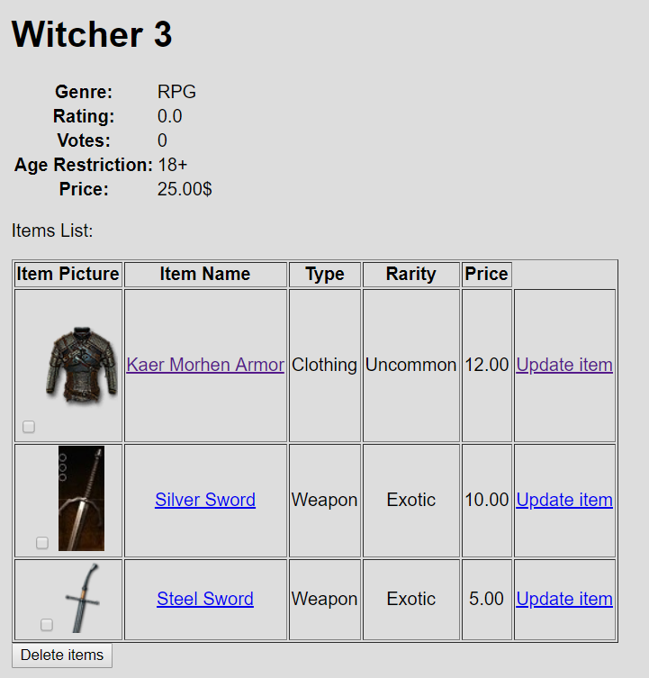

   Items as seen by an admin

Item Adding
-----------
Items can be added by clicking the "Add item" link down below.

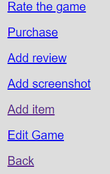

Once an admin clicks the link, they are met with the
item adding page.

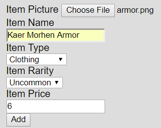

   Item adding page

Once the item is added, the admin is met with the result page.

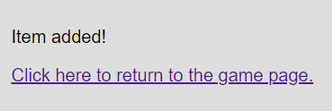

   Item adding result page

Item Updating
-------------
Items can be updated by clicking the "Update item" link
on the Items table.

Once the admin clicks on the link, they are met with the
item updating page.

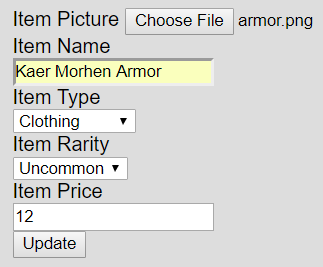

   Item updating page

Once the item is updated, the admin is met with the result page.

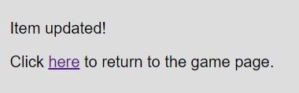

   Item updating page

Item Deleting
-------------
Items can be deleted by selecting the items that the admins
wishes to deleted and clicking on "Delete items"

ITEMS OF USERS
==============

Users can purchase items for a game and level up, customize
or discard items that they own.

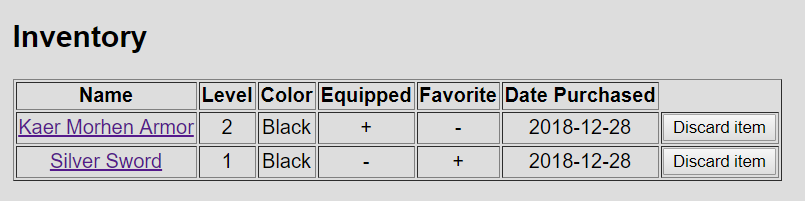

   Items of a user

Item Purchasing
---------------
If a user clicks on an item displayed on the game page, they
will be directed to the item purchasing page.

Since admins have infinite balance, they can purchase items
freely. Users, on the other hand, can only purchase items
that they can afford.

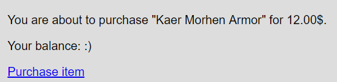

   Admin item purchasing

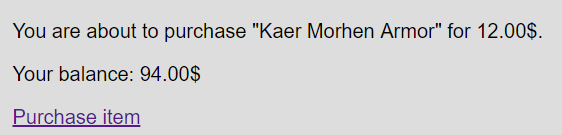

   Regular user item purchasing

If the item purchasing is successful, the user will be met with
the success message.

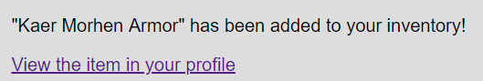

   Purchasing success

If the item is not purchased, the user will be met with the
fail message.

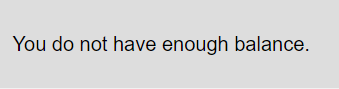

   Purchasing fail

If a user buys an item that they already own, the item will
be leveled up and they will be met with the level up message.

.. figure:: screenshots_baran/item_level_up.png
   :scale: 80 %

   Item leveling up

Item Customization
------------------
Users can customize their items by clicking on the item name
under their inventory.

Once the users clicks on an item in their inventory, they will
be met with the item customization page.

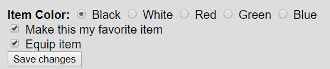

   Item customization

Once the item is customize, the user will be met with the result page.

   Item customization result

Item Discarding
---------------
Users can discard their items by clicking on the "Discard item"
button next to their items in the inventory.

SCREENSHOT COMMENTS
===================

Users can comment on screenshots that have been uploaded
for a game.

Commenting
----------
If a user clicks on a screenshot, they will be directed to the
screenshot's page where the comments will be displayed.

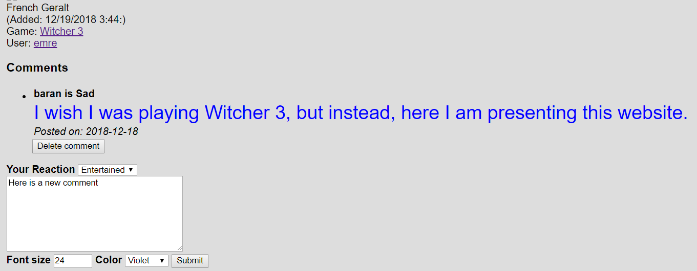

   Leaving a comment

Once the user submits their comment, the comment will be displayed
under the screenshot.

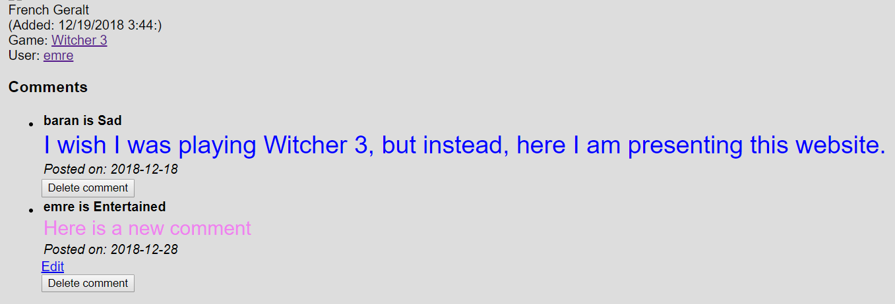

   Added comment

Editing a comment
-----------------
Users can also edit the comments that they post by clicking on
the "edit" link under their comments

Once they edit their comment, they will be met with the result page.

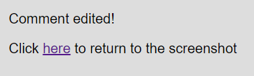

   Comment editing result

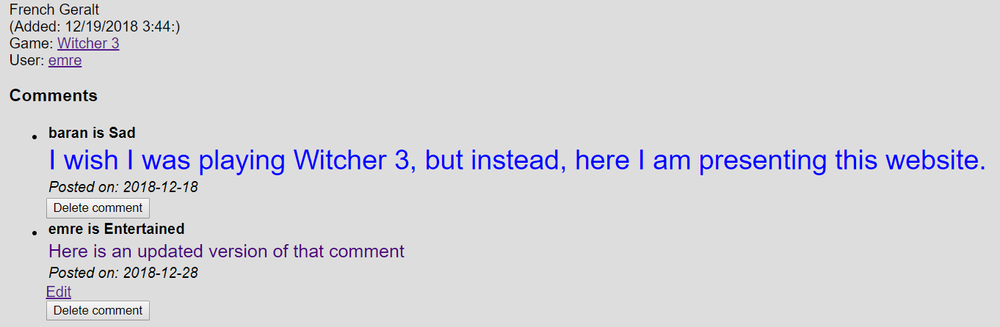

   Comment editing

Deleting a comment
------------------
Users can delete comments by pressing the "Delete comment"
button under the comment.

Admins can delete every comment under a screenshot.

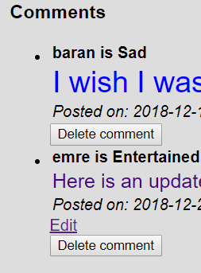

   Comment deleting as seen by an admin

Users can only delete their own comments

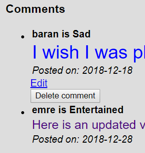

   Comment deleting as seen by a regular user