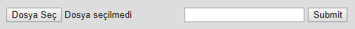

Parts Implemented by Cavit Özbay
********************************

Sign Up Page
============

.. figure:: signup.png
   :scale: 80 %
   :alt: Sign Up Form
   
   Sign Up Form

This is the caption of the Sign Up form in the “Sign Up” page. You may
use it to create a new user. Sign up result may seem like:

..

   +---------------------------------------+-----------------------------------------------------+
   |Successful                             | Unsuccessful                                        |
   +=======================================+=====================================================+
   |.. figure:: signupresultsuccessful.png |.. figure:: signupresultunsuccessful.png             |
   |   :scale: 80 %                        |   :scale: 80 %                                      |
   |   :alt: Successful Sign Up Result     |   :alt: Unsuccessful Sign Up Result                 |
   |                                       |                                                     |
   |                                       |                                                     |
   +---------------------------------------+-----------------------------------------------------+

Log In Page
===========

Once you create an account successfully, you can log in to your
account via “Log In” page.

   Log in form

If you can not log in, you are going to redirect to “Log In” page
again. If you log in, you are going to redirect to your profile.

Profile
=======

Reviews
-------

In any user profile, you can see the reviews and screenshot links of
the profile owner at the bottom of “Reviews” and “Screenshots”
headers.

   Review In a Profile

Reviews may be liked or disliked with these buttons. Also if you are
the owner of the review, you are going to be able to see “Delete
review” button.

Screenshot Links
----------------

   Screenshot Link In a Profile

You can go to the screenshots’ related page by clicking on it.
Screenshots may be liked or disliked with these buttons. Also if you
are the owner of the screenshot, you are going to be able to see
“Delete screenshot” button.

Account Deletion
----------------

.. figure:: deleteaccount.png
   :scale: 80 %
   :alt: Delete Account

   Delete Account Link

Also, you can delete your account by using the “Delete account” link
in your own profile.

Game Page
=========

Reviews  and Screenshot Links
-----------------------------

In any game page, you can see the reviews and screenshot links of the
game at the bottom of “Reviews” and “Screenshots” headers. The only
difference between displays in these pages and profile pages is that
user name of the owner displayed here, instead of game title (like
profile page).

.. figure:: reviewingamepage.png
   :scale: 80 %
   :alt: Review In a Game Page

   Review In a Game Page

.. figure:: screenshotlinkingamepage.png
   :scale: 80 %
   :alt: Screenshot Link In a Game Page

   Screenshot Link In a Game Page

Review Addition/Edition
-----------------------

In order to add or edit a review to a game, you can use the “Add
review” link.

   Add/Edit Review Form

You must have only 1 review for each game. If you have a review for
the game before, previous review contents are going to be displayed in
the corresponding areas. You can change them however you want. If it
is your first review for the game, you can write your review. After
both of them, you must submit the review.

Screenshot Addition
-------------------

   Add Screenshot Form

You can choose your screenshot and caption for screenshot from there.
Your screenshot may only be in formats “.jpg” or “.png”.

Screenshot Page
===============

.. figure:: screenshotpage.png
   :scale: 80 %
   :alt: Screenshot Page

   Screenshot Page

You can display the screenshot with its real size in screenshot page.

Adminstration
=============

Admins are able to see all deletion buttons (Delete review, Delete
screenshot, Delete account).
