Parts Implemented by Ömer Emre Ekici
====================================
-----
STORE
-----
* The store page lists the games available on the website. Admins have
  the capability to add or delete games.

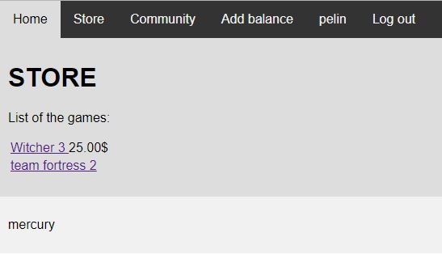

The store seen by a regular user

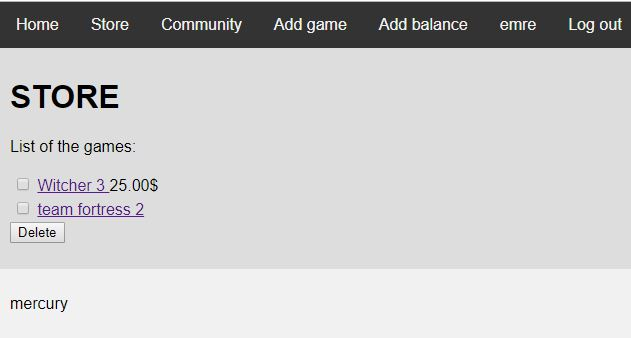

The store seen by an admin

Adding games to the store
~~~~~~~~~~~~~~~~~~~~~~~~~

* Admins can add games to the store via the "Add game" link in the
  navigation bar.

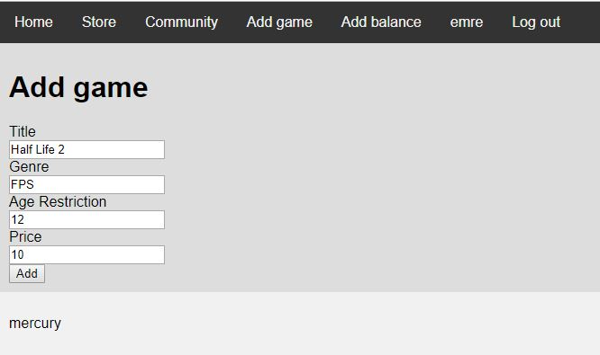

The data about the game has to be provided.

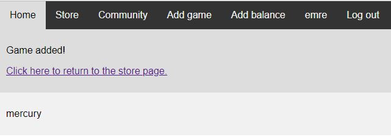

The result page after the game is added.

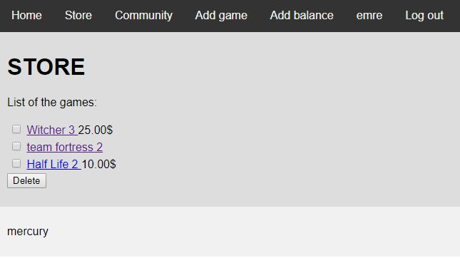

The added game is now listed at the store.

Deleting games from the store
~~~~~~~~~~~~~~~~~~~~~~~~~~~~~

* Games can also be deleted by admins.

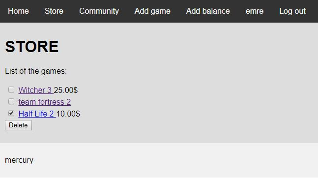

The game to be deleted is checked

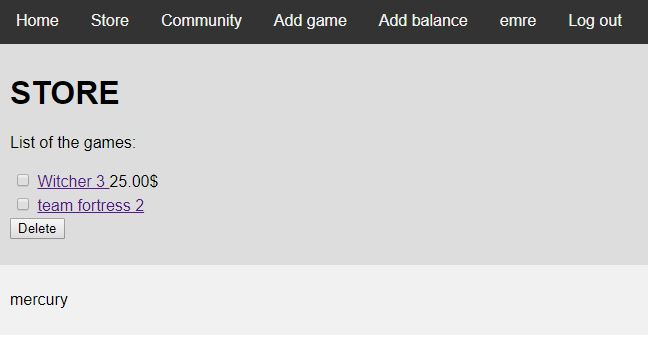

The selected game is deleted from the website

---------
GAME PAGE
---------

* The game page can be reached by clicking the name of the game on
  the store. This page contains the data of the game and buttons for
  various features, such as purchasing, rating and (for admins)
  editing the game.

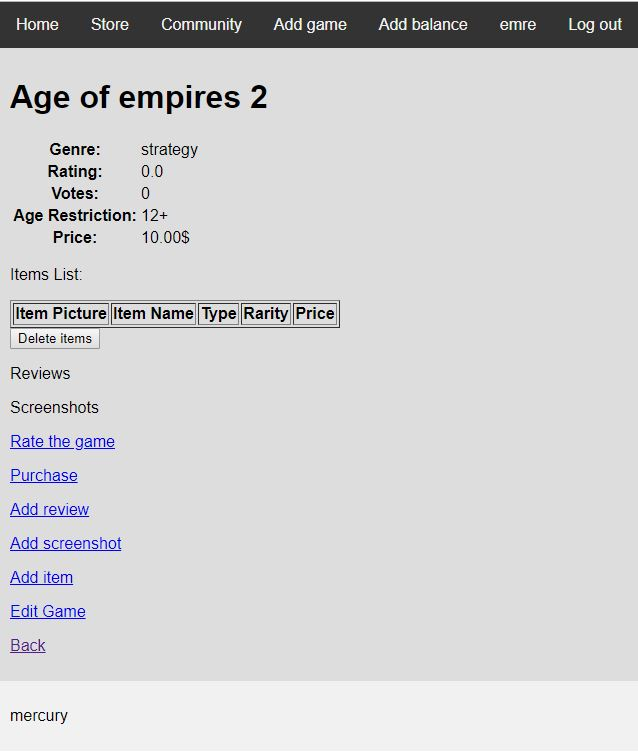

The game page

Rating a game
~~~~~~~~~~~~~

* Users can rate the game.

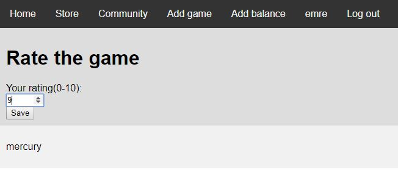

The rating is entered by the user

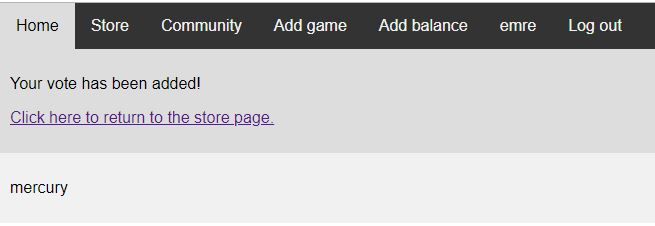

The vote is processed

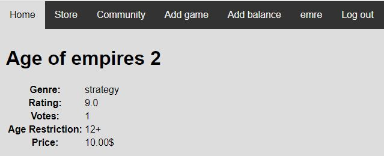

The game has been rated

Editing a game
~~~~~~~~~~~~~~

* Admins can change the information of the game

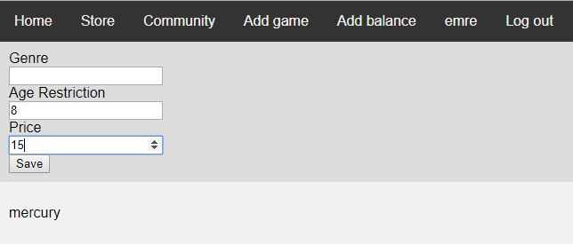

The new data has to be provided. If a field is left blank, the
original information is preserved.

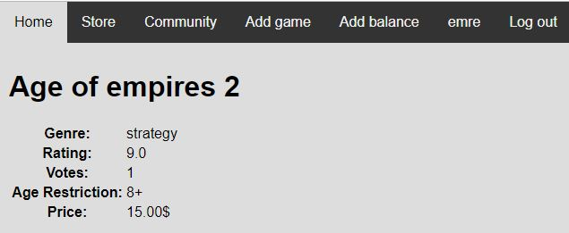

The data of the game has been changed

Purchasing a game
~~~~~~~~~~~~~~~~~

* Users can purchase a game if they have enough balance. Admins have
  infinite balance.

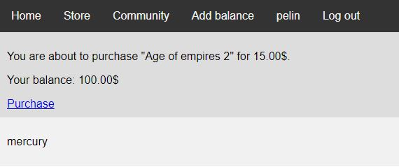

Game is about to be purchased

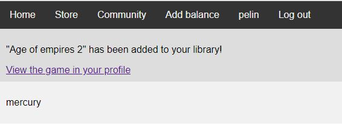

Game is purchased

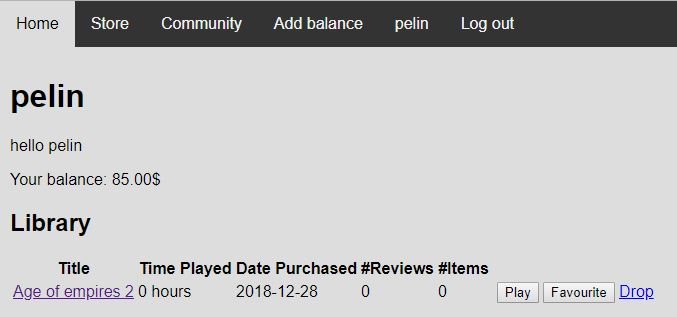

The user can view the game in their profile

Adding Balance
~~~~~~~~~~~~~~

* Users have to enter a valid code to add balance to their account.

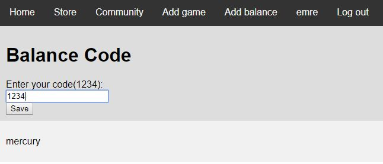

One such code is "1234"

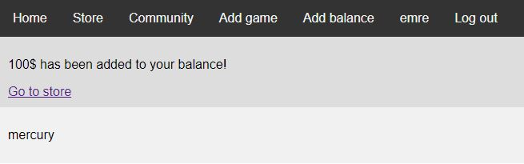

100$ has been added to the user's account

-------
PROFILE
-------

In their profile, users can view their library of the games they
own, the list of their friends and the friend requests they have
sent and received.

Library
~~~~~~~

User's library

.. image:: screenshots_emre/game_played.JPG
    :width: 600

Game has been played 1 hour

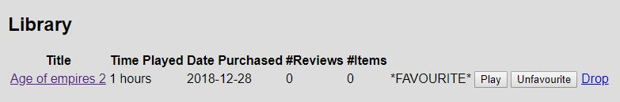

Game is favourited by the user

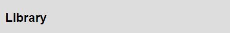

The game is deleted from the user's library

Friends
~~~~~~~

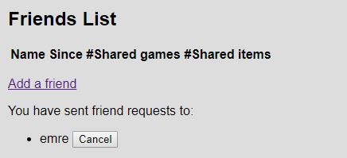

A friend request has been sent

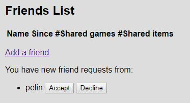

The request has been received by the other user

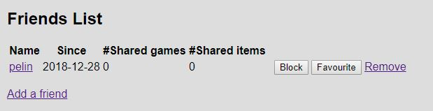

The request is accepted

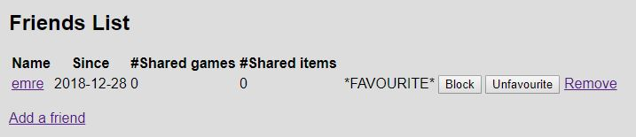

The friend is favourited by the user

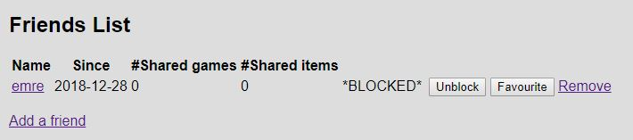

The friend is blocked by the user

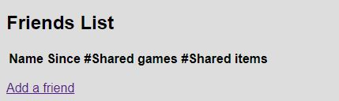

The friend is removed

Avatar
~~~~~~

Users can upload an image as their profile photo by clicking the
"Change avatar" button at the buttom of their profile page.

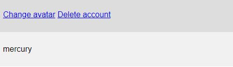

The link to the image uploading page

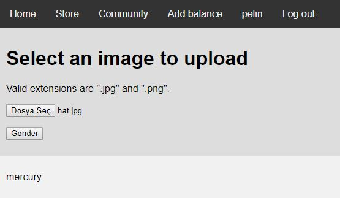

The image is selected from the user's PC

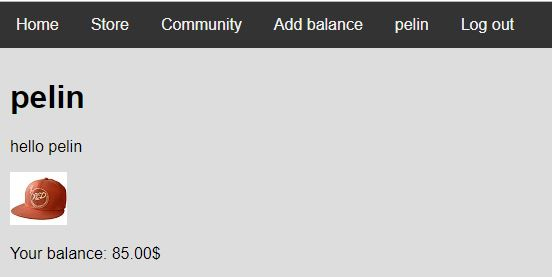

The new avatar is displayed on the profile

---------
COMMUNITY
---------

The community page displays the activities of the user and the
user's friends sorted by the date, descending. The blocked friends'
activities is not shown.

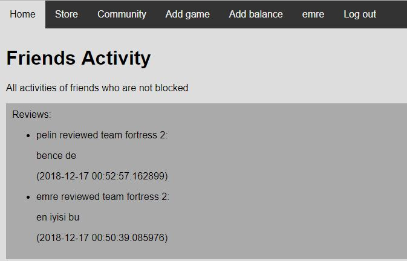

The reviews in the community feed

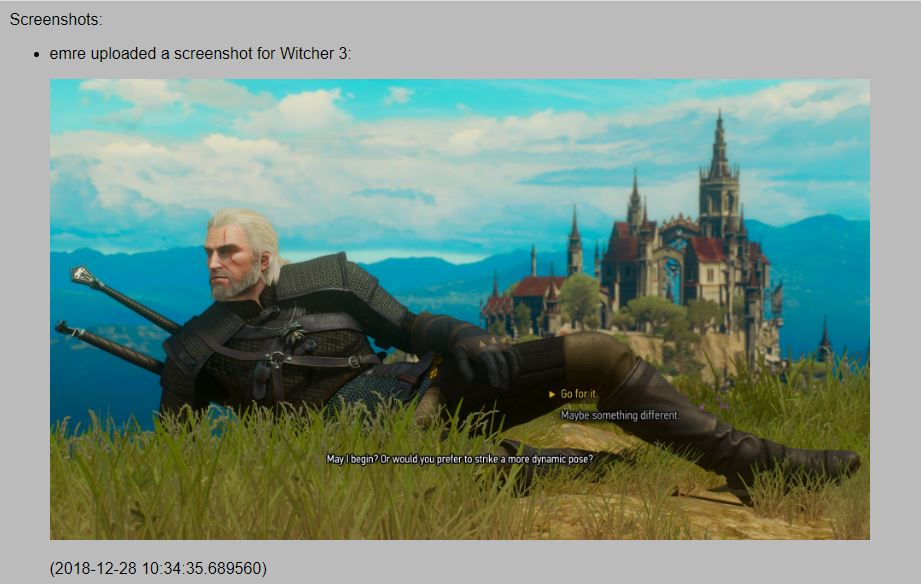

Screenshots uploaded in the community feed